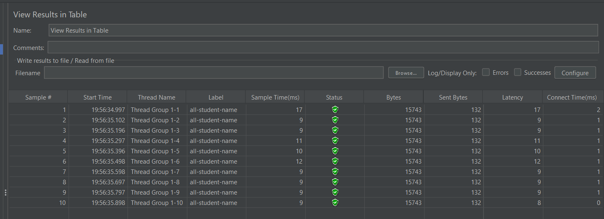
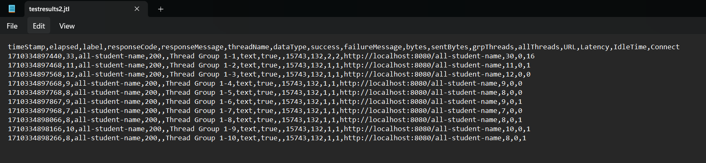
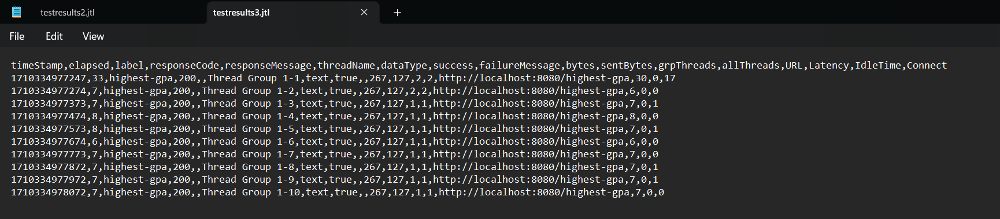

Reflections

1. For me, jmeter is more like a test that simulates a high scale loads on an application, focusing on overall performance under various conditions. Meanwhile, IntelliJ's Profiler could show us a more detailed information on CPU analyze, memory usage, etc, where it could identify specific inefficiencies in the code.

2. Profiling provides detailed insights into the application's runtime behavior, such as memory leaks, excessive CPU usage, and inefficient code paths, that shows us on which specific methods that caused the issues

3. Yes, IntelliJ Profiler is pretty helpful in identifying bottlenecks. Its integration within the intellij IDE interface simplifies the process of analyzing application performance and friendly for user interface.

4. So far, the challenges that I faced is when i need to optimize one of the methods, where i have to do some searchings on the internet on how to leverage the JPA query.

5. The main benefits is the seamless integration with the IDE environment, the ability to directly link performance issues to specific lines of code, and the comprehensive insights into application performance it provides, all of which helps me know exactly where what are the problems in my code.

6. I could try to do some re-tests, and maybe aligning the mock ups used for testing so it could be more relevant with each other, while fixing the code issues.

7. When doing a refactor on inefficient code. I need to ensure that changes do not affect functionality by checking my test results with my previous one where it haven't been modified yet, and i have to make sure that each method that i refactor are having the exact same goals.

Testing on all student name and highest gpa screenshots:
all-student-name:

highest-gpa:

